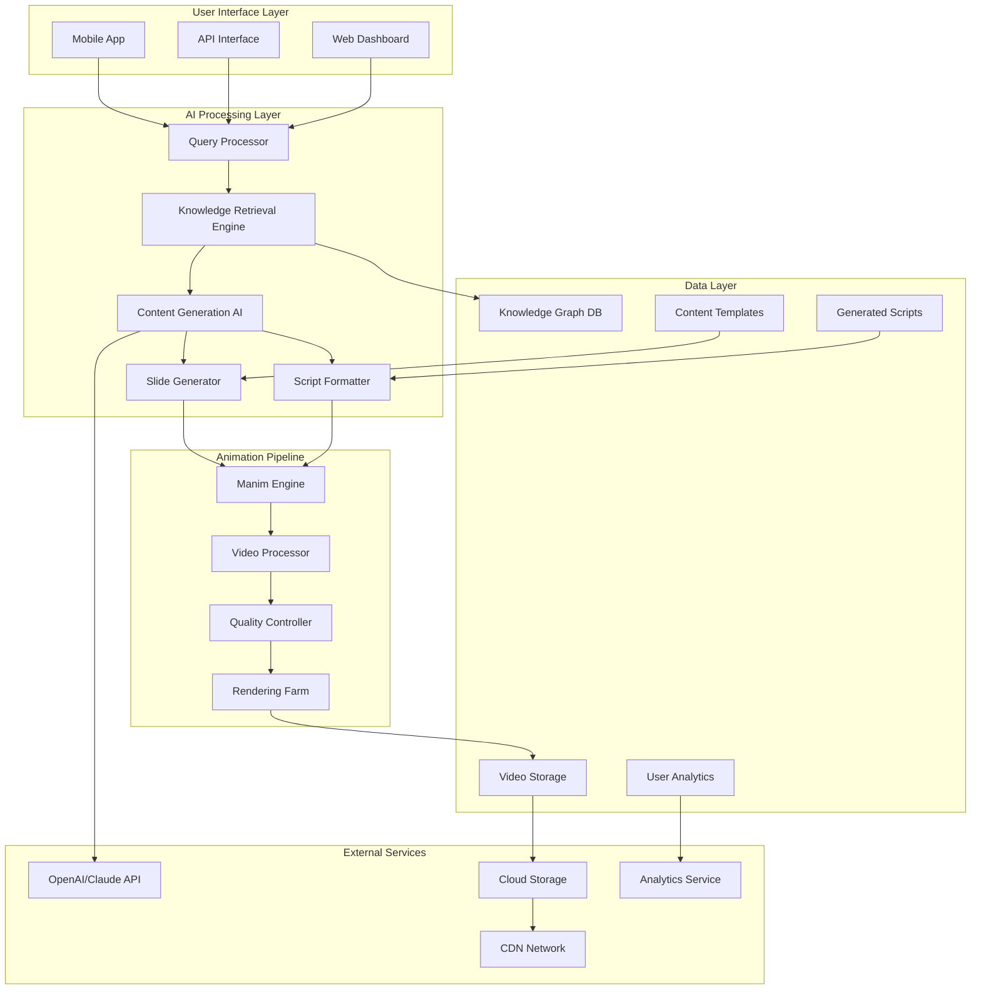
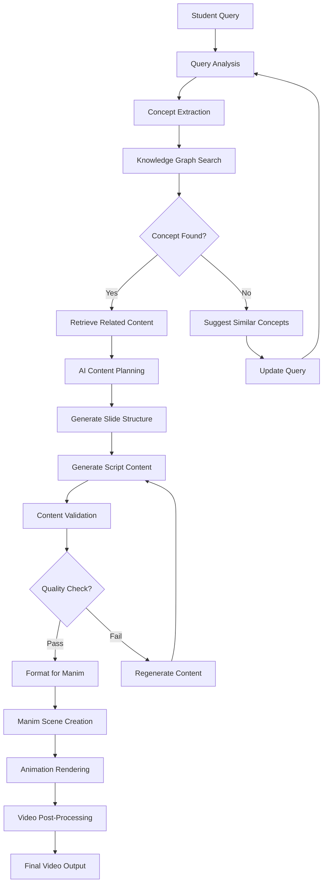
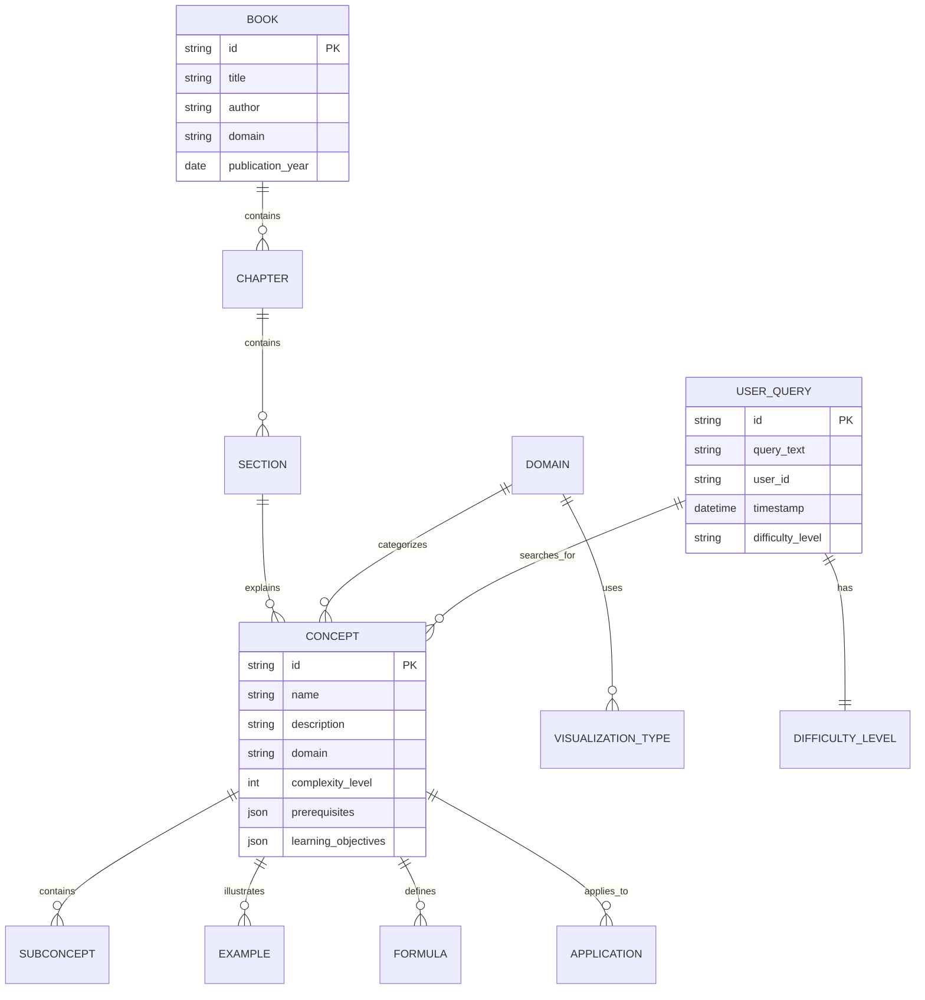
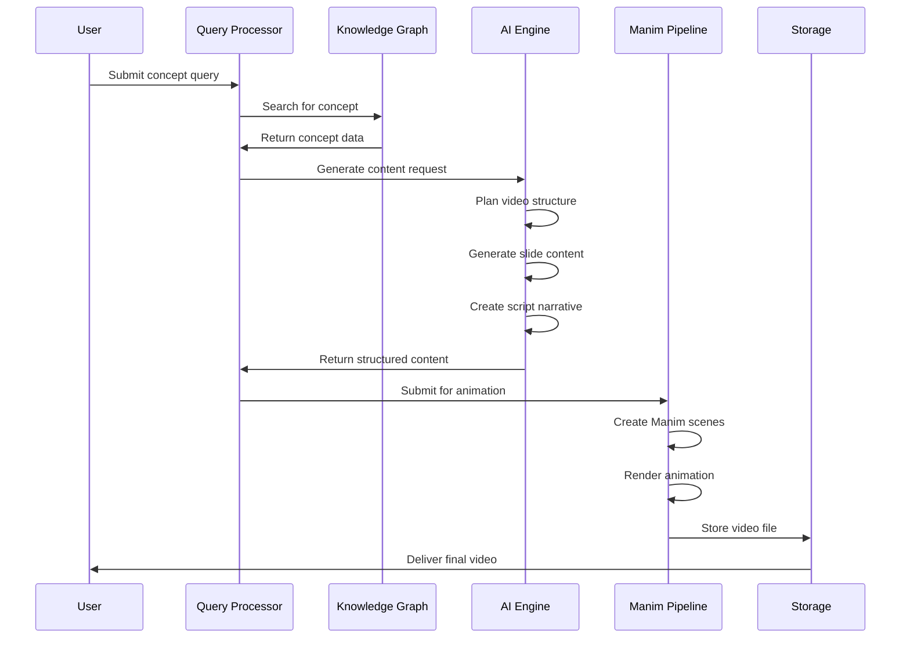
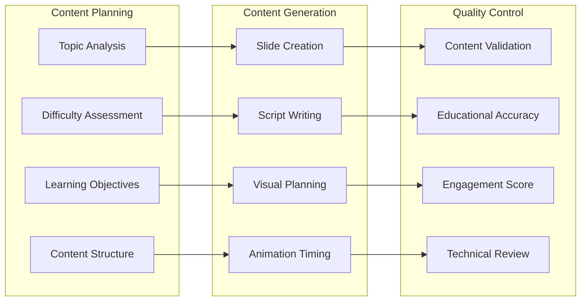
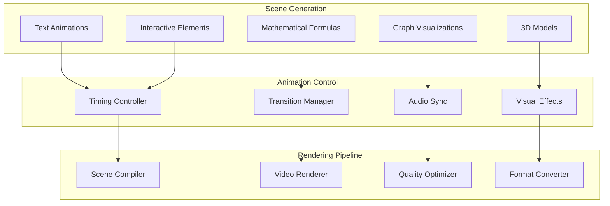
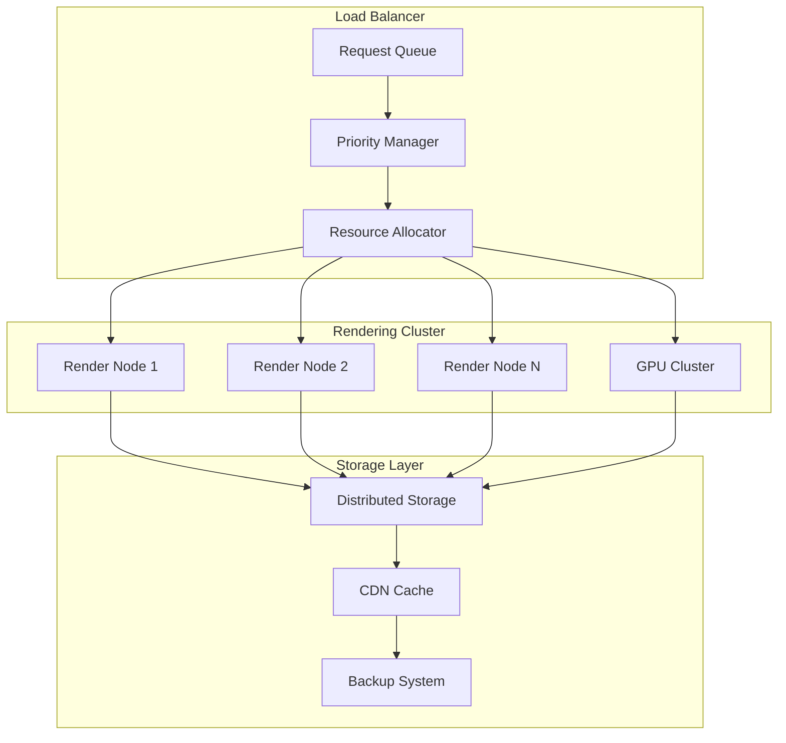
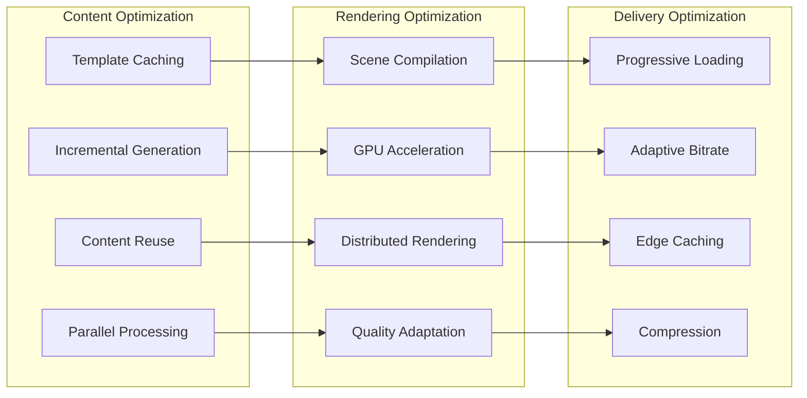
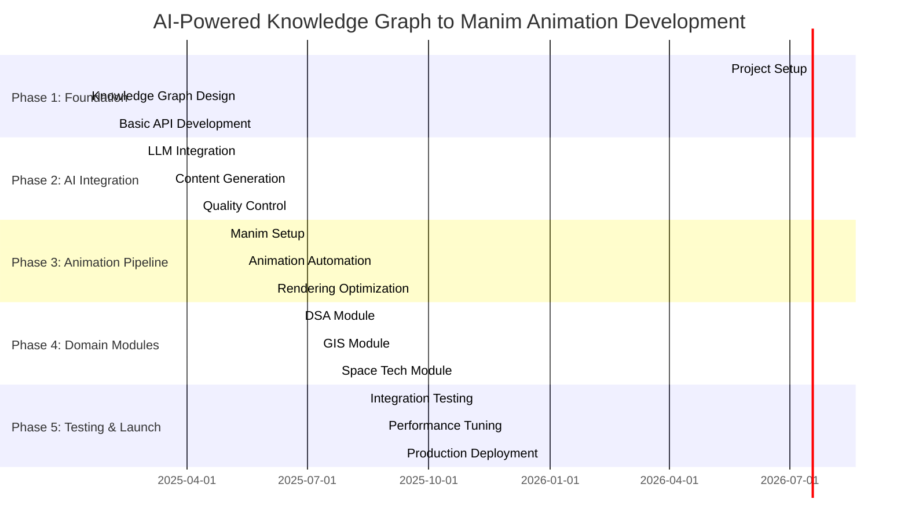

# AI-Powered Knowledge Graph to Manim Animation Automation - Project Documentation

## 📚 Table of Contents
- [Project Overview](#project-overview)
- [Key Features](#key-features)
- [System Architecture](#system-architecture)
- [AI Pipeline Flow](#ai-pipeline-flow)
- [Technical Specifications](#technical-specifications)
- [Technology Stack Comparison](#technology-stack-comparison)
- [Implementation Plan](#implementation-plan)
- [Pseudocode Examples](#pseudocode-examples)
- [Development Timeline](#development-timeline)
- [Performance & Scalability](#performance--scalability)

---

## Project Overview

The **AI-Powered Knowledge Graph to Manim Animation Automation** is an intelligent system that transforms educational content into engaging animated videos. Students can query specific concepts from a comprehensive knowledge graph, and the AI automatically generates structured slides, detailed scripts, and converts them into high-quality animated educational videos using Manim.

### Problem Statement
- Creating educational videos is time-intensive and requires specialized skills
- Students struggle to find comprehensive explanations for complex concepts
- Traditional learning materials lack visual engagement
- Educators need efficient tools to create animated content at scale

### Solution
An AI-driven platform that:
- Automatically extracts relevant knowledge from structured data
- Generates educational content using advanced AI models
- Creates professional animated videos without manual intervention
- Supports specialized domains (GIS, Space Tech, DSA)

---

## Key Features

### Core Features
- **Intelligent Knowledge Extraction**: Graph-based concept retrieval from academic content
- **AI Content Generation**: Automated slide and script creation using LLMs
- **Manim Animation Pipeline**: Seamless conversion to animated videos
- **Multi-Domain Support**: Specialized modules for GIS, Space Tech, and DSA
- **Natural Language Queries**: Student-friendly concept search

### Advanced Features
- **Adaptive Learning Paths**: Personalized content based on user level
- **Interactive Elements**: Clickable annotations and quizzes
- **Multi-Language Support**: Content generation in multiple languages
- **Quality Assessment**: AI-driven content validation and improvement
- **Batch Processing**: Bulk video generation for course materials

---

## System Architecture



## AI Pipeline Architecture



## Knowledge Graph Structure



---

## Content Generation Flow



---

## Technical Specifications

### AI Content Generation Pipeline


### Manim Animation Architecture


---

## Technology Stack Comparison

### AI/ML Frameworks

| Technology | Pros | Cons | Rating | Recommendation |
|------------|------|------|--------|----------------|
| **OpenAI GPT-4/Claude** ✅ | Advanced reasoning, Code generation, Multi-modal | API costs, Rate limits, Dependency | 9/10 | **Recommended** |
| Hugging Face Transformers | Open source, Custom models, Local deployment | Requires ML expertise, Resource intensive | 8/10 | Alternative |
| Google Vertex AI | Integrated ecosystem, AutoML, Scalable | Vendor lock-in, Complex pricing | 7/10 | Enterprise option |
| LangChain | Framework flexibility, Tool integration | Learning curve, Rapid changes | 8/10 | **Recommended for orchestration** |

### Knowledge Graph Databases

| Technology | Pros | Cons | Rating | Recommendation |
|------------|------|------|--------|----------------|
| **Neo4j** ✅ | Graph-native, Cypher query language, Visualization tools | Licensing costs, Memory usage | 9/10 | **Recommended** |
| Amazon Neptune | Managed service, Multiple query languages, Scalable | AWS lock-in, Complex pricing | 8/10 | Cloud alternative |
| ArangoDB | Multi-model, Good performance, Open source | Smaller community, Limited tools | 7/10 | Alternative |
| NetworkX + Python | Free, Programmatic control, Flexible | Not database, Limited scalability | 6/10 | Prototyping only |

### Animation & Video Processing

| Technology | Pros | Cons | Rating | Recommendation |
|------------|------|------|--------|----------------|
| **Manim** ✅ | Mathematical animations, Python-based, High quality | Learning curve, Rendering time | 9/10 | **Recommended** |
| Blender Python API | 3D capabilities, Professional quality, Open source | Complex setup, Resource intensive | 8/10 | Advanced features |
| p5.js | Web-based, Interactive, Easy deployment | Limited math features, Performance | 6/10 | Web demos only |
| FFmpeg | Video processing, Format conversion, Lightweight | No animation creation, Low-level | 7/10 | **Recommended for post-processing** |

### Backend Infrastructure

| Technology | Pros | Cons | Rating | Recommendation |
|------------|------|------|--------|----------------|
| **Python + FastAPI** ✅ | AI ecosystem, Async support, Auto docs, Type hints | GIL limitations, Memory usage | 9/10 | **Recommended** |
| Node.js + Express | JavaScript ecosystem, Fast development, NPM packages | Single-threaded, Not ideal for CPU tasks | 7/10 | Frontend only |
| Go + Gin | High performance, Concurrent, Simple deployment | Smaller AI ecosystem, Learning curve | 8/10 | Microservices |
| Python + Django | Rapid development, Admin interface, ORM | Monolithic, Slower for APIs | 7/10 | Not recommended |

### Queue & Task Management

| Technology | Pros | Cons | Rating | Recommendation |
|------------|------|------|--------|----------------|
| **Celery + Redis** ✅ | Python integration, Distributed tasks, Monitoring | Configuration complexity, Memory usage | 9/10 | **Recommended** |
| Apache Kafka | High throughput, Durable, Scalable | Complex setup, Overkill for small scale | 8/10 | Large scale |
| RabbitMQ | Reliable, Feature-rich, Good docs | Resource usage, Management overhead | 7/10 | Alternative |
| Amazon SQS | Managed service, Scalable, Reliable | AWS lock-in, Limited features | 7/10 | Cloud option |

---

## Implementation Plan

### Phase 1: Foundation & Knowledge Graph (Weeks 1-6)
- [ ] **Week 1-2**: Project setup and architecture design
  - Set up development environment
  - Design system architecture
  - Choose and configure technology stack
- [ ] **Week 3-4**: Knowledge graph implementation
  - Design graph schema for educational content
  - Implement data ingestion pipeline
  - Create graph traversal algorithms
- [ ] **Week 5-6**: Basic content retrieval
  - Implement concept search functionality
  - Create RESTful API endpoints
  - Basic query processing system

### Phase 2: AI Content Generation (Weeks 7-12)
- [ ] **Week 7-8**: AI integration setup
  - Integrate LLM APIs (OpenAI/Claude)
  - Design prompt engineering system
  - Implement content generation pipeline
- [ ] **Week 9-10**: Content structuring
  - Slide generation algorithms
  - Script formatting system
  - Content validation mechanisms
- [ ] **Week 11-12**: Quality control
  - Implement content quality assessment
  - A/B testing framework for prompts
  - Error handling and retry mechanisms

### Phase 3: Manim Animation Pipeline (Weeks 13-18)
- [ ] **Week 13-14**: Manim integration
  - Set up Manim environment
  - Create base animation templates
  - Implement scene generation from content
- [ ] **Week 15-16**: Animation automation
  - Dynamic scene creation system
  - Animation timing optimization
  - Video rendering pipeline
- [ ] **Week 17-18**: Rendering optimization
  - Parallel processing implementation
  - Video quality optimization
  - Storage and delivery system

### Phase 4: Domain Specialization (Weeks 19-24)
- [ ] **Week 19-20**: GIS module
  - Geographic visualization templates
  - Map animation capabilities
  - Spatial data integration
- [ ] **Week 21-22**: Space Tech module
  - 3D space visualizations
  - Orbital mechanics animations
  - Astronomy content templates
- [ ] **Week 23-24**: DSA module
  - Algorithm visualization
  - Data structure animations
  - Code execution flow

### Phase 5: Testing & Deployment (Weeks 25-30)
- [ ] **Week 25-26**: Comprehensive testing
  - Unit and integration testing
  - Performance testing
  - User acceptance testing
- [ ] **Week 27-28**: Optimization
  - Performance tuning
  - Cost optimization
  - Security hardening
- [ ] **Week 29-30**: Production deployment
  - Infrastructure setup
  - Monitoring and logging
  - Launch preparation

---

## Pseudocode Examples

### Knowledge Graph Query System
```pseudocode
FUNCTION queryKnowledgeGraph(userQuery, domain, difficultyLevel)
    INPUT: userQuery (string), domain (string), difficultyLevel (int 1-5)
    OUTPUT: Structured concept data with relationships
    
    BEGIN
        // Preprocess user query
        processedQuery = preprocessQuery(userQuery)
        keywords = extractKeywords(processedQuery)
        
        // Build Cypher query for Neo4j
        cypherQuery = """
            MATCH (c:Concept)-[:BELONGS_TO]->(d:Domain)
            WHERE d.name = $domain
            AND c.complexity_level <= $difficultyLevel
            AND ANY(keyword IN $keywords WHERE c.name CONTAINS keyword 
                                          OR c.description CONTAINS keyword)
            
            OPTIONAL MATCH (c)-[:HAS_PREREQUISITE]->(pre:Concept)
            OPTIONAL MATCH (c)-[:HAS_EXAMPLE]->(ex:Example)
            OPTIONAL MATCH (c)-[:RELATES_TO]->(rel:Concept)
            
            RETURN c, COLLECT(DISTINCT pre) as prerequisites,
                   COLLECT(DISTINCT ex) as examples,
                   COLLECT(DISTINCT rel) as related_concepts
            ORDER BY c.relevance_score DESC
            LIMIT 10
        """
        
        results = DATABASE.execute(cypherQuery, {
            domain: domain,
            difficultyLevel: difficultyLevel,
            keywords: keywords
        })
        
        // Score and rank results
        rankedResults = []
        FOR EACH result IN results
            score = calculateRelevanceScore(result.c, keywords, userQuery)
            concept = {
                id: result.c.id,
                name: result.c.name,
                description: result.c.description,
                prerequisites: result.prerequisites,
                examples: result.examples,
                related_concepts: result.related_concepts,
                relevance_score: score
            }
            rankedResults.APPEND(concept)
        END FOR
        
        // Sort by relevance and return
        rankedResults = SORT(rankedResults, BY relevance_score DESC)
        RETURN rankedResults
    END
END FUNCTION

FUNCTION calculateRelevanceScore(concept, keywords, originalQuery)
    // Calculate semantic similarity
    semanticScore = calculateSemanticSimilarity(concept.description, originalQuery)
    
    // Calculate keyword match score
    keywordScore = 0
    FOR EACH keyword IN keywords
        IF concept.name CONTAINS keyword THEN
            keywordScore += 2
        ELSE IF concept.description CONTAINS keyword THEN
            keywordScore += 1
        END IF
    END FOR
    
    // Normalize keyword score
    keywordScore = MIN(keywordScore / (LENGTH(keywords) * 2), 1.0)
    
    // Calculate complexity penalty (prefer simpler explanations)
    complexityPenalty = concept.complexity_level * 0.1
    
    // Final weighted score
    finalScore = (semanticScore * 0.6) + (keywordScore * 0.4) - complexityPenalty
    
    RETURN finalScore
END FUNCTION
```

### AI Content Generation Pipeline
```pseudocode
FUNCTION generateEducationalContent(concept, targetAudience, videoLength)
    INPUT: concept (object), targetAudience (string), videoLength (int minutes)
    OUTPUT: Structured content with slides and script
    
    BEGIN
        // Initialize content structure
        contentPlan = planContentStructure(concept, videoLength)
        
        // Generate slides
        slides = []
        FOR EACH section IN contentPlan.sections
            slide = generateSlide(section, concept, targetAudience)
            slides.APPEND(slide)
        END FOR
        
        // Generate narrative script
        script = generateScript(concept, slides, targetAudience)
        
        // Validate and improve content
        validation = validateContent(slides, script, concept)
        IF validation.score < 0.8 THEN
            content = improveContent(slides, script, validation.feedback)
            slides = content.slides
            script = content.script
        END IF
        
        // Format for Manim
        manimInstructions = formatForManim(slides, script)
        
        RETURN {
            slides: slides,
            script: script,
            manim_instructions: manimInstructions,
            metadata: {
                concept_id: concept.id,
                generated_at: getCurrentTimestamp(),
                target_audience: targetAudience,
                estimated_duration: videoLength
            }
        }
    END
END FUNCTION

FUNCTION generateSlide(section, concept, targetAudience)
    // Construct AI prompt
    prompt = f"""
    Create an educational slide for the concept: {concept.name}
    Section: {section.title}
    Target Audience: {targetAudience}
    
    Include:
    1. Clear heading
    2. Key points (3-5 bullet points)
    3. Visual elements description
    4. Mathematical formulas if applicable
    5. Code snippets if relevant
    
    Prerequisites mentioned: {concept.prerequisites}
    Learning objectives: {concept.learning_objectives}
    
    Format as JSON with fields: heading, content_points, visual_elements, formulas, code
    """
    
    response = AI_API.generate(prompt, temperature=0.7, max_tokens=800)
    slide = JSON.parse(response)
    
    // Add Manim-specific annotations
    slide.animations = determineAnimations(slide)
    slide.timing = calculateSlideTiming(slide, section.duration)
    
    RETURN slide
END FUNCTION

FUNCTION generateScript(concept, slides, targetAudience)
    // Create comprehensive script prompt
    scriptPrompt = f"""
    Write an engaging educational script for a video about: {concept.name}
    Target Audience: {targetAudience}
    
    Slides to cover:
    {formatSlidesForPrompt(slides)}
    
    Requirements:
    - Conversational and engaging tone
    - Clear transitions between concepts
    - Include timing cues for animations
    - Add pauses for complex concepts
    - Include call-to-action for further learning
    
    Format as JSON with: introduction, slide_narrations, conclusion, timing_cues
    """
    
    scriptResponse = AI_API.generate(scriptPrompt, temperature=0.6, max_tokens=1500)
    script = JSON.parse(scriptResponse)
    
    // Synchronize with slide timings
    script = synchronizeWithSlides(script, slides)
    
    RETURN script
END FUNCTION
```

### Manim Animation Generator
```pseudocode
FUNCTION generateManimAnimation(slides, script, outputPath)
    INPUT: slides (array), script (object), outputPath (string)
    OUTPUT: Generated video file path
    
    BEGIN
        // Initialize Manim scene
        scene = ManimScene()
        totalDuration = 0
        
        // Add introduction
        scene.addIntroSequence(script.introduction)
        totalDuration += script.introduction.duration
        
        // Process each slide
        FOR i = 0 TO LENGTH(slides) - 1
            slide = slides[i]
            narration = script.slide_narrations[i]
            
            // Create slide elements
            elements = createSlideElements(slide)
            
            // Add slide to scene
            scene.addSlide(elements, narration, slide.timing)
            totalDuration += slide.timing.duration
            
            // Add transitions
            IF i < LENGTH(slides) - 1 THEN
                transition = createTransition(slide, slides[i+1])
                scene.addTransition(transition)
                totalDuration += transition.duration
            END IF
        END FOR
        
        // Add conclusion
        scene.addConclusionSequence(script.conclusion)
        totalDuration += script.conclusion.duration
        
        // Render video
        renderConfig = {
            quality: "1080p",
            frame_rate: 60,
            output_path: outputPath,
            audio_sync: TRUE
        }
        
        videoPath = scene.render(renderConfig)
        
        RETURN {
            video_path: videoPath,
            duration: totalDuration,
            file_size: getFileSize(videoPath),
            render_time: scene.getRenderTime()
        }
    END
END FUNCTION

FUNCTION createSlideElements(slide)
    elements = []
    
    // Create title
    title = ManimText(slide.heading)
    title.setStyle(fontSize=48, color=BLUE, weight=BOLD)
    elements.APPEND({type: "title", object: title, animation: "fade_in"})
    
    // Create content points
    FOR EACH point IN slide.content_points
        bullet = ManimBulletPoint(point)
        bullet.setStyle(fontSize=32, color=WHITE)
        elements.APPEND({
            type: "bullet", 
            object: bullet, 
            animation: "slide_from_left",
            delay: 0.5
        })
    END FOR
    
    // Add mathematical formulas
    IF slide.formulas IS NOT EMPTY THEN
        FOR EACH formula IN slide.formulas
            mathObj = ManimMathTex(formula.latex)
            mathObj.setStyle(fontSize=36, color=YELLOW)
            elements.APPEND({
                type: "formula",
                object: mathObj,
                animation: "write_formula",
                duration: 2.0
            })
        END FOR
    END IF
    
    // Add code snippets
    IF slide.code IS NOT EMPTY THEN
        codeObj = ManimCode(slide.code.content, language=slide.code.language)
        codeObj.setStyle(fontSize=24, theme="monokai")
        elements.APPEND({
            type: "code",
            object: codeObj,
            animation: "type_code",
            duration: 3.0
        })
    END IF
    
    // Add visual elements based on domain
    IF slide.visual_elements IS NOT EMPTY THEN
        visuals = createDomainSpecificVisuals(slide.visual_elements)
        elements.EXTEND(visuals)
    END IF
    
    RETURN elements
END FUNCTION
```

### Domain-Specific Visualization
```pseudocode
FUNCTION createDomainSpecificVisuals(visualElements, domain)
    INPUT: visualElements (array), domain (string)
    OUTPUT: Array of Manim visual objects
    
    BEGIN
        visuals = []
        
        SWITCH domain
            CASE "Data Structures & Algorithms":
                visuals = createDSAVisualizations(visualElements)
            CASE "GIS":
                visuals = createGISVisualizations(visualElements)
            CASE "Space Technology":
                visuals = createSpaceVisualizations(visualElements)
            DEFAULT:
                visuals = createGenericVisualizations(visualElements)
        END SWITCH
        
        RETURN visuals
    END
END FUNCTION

FUNCTION createDSAVisualizations(elements)
    visuals = []
    
    FOR EACH element IN elements
        SWITCH element.type
            CASE "array":
                array = ManimArray(element.data)
                array.setStyle(cellWidth=60, cellHeight=40, borderColor=WHITE)
                visuals.APPEND({
                    object: array,
                    animation: "create_array",
                    operations: element.operations
                })
                
            CASE "tree":
                tree = ManimBinaryTree(element.nodes)
                tree.setLayout("balanced")
                visuals.APPEND({
                    object: tree,
                    animation: "grow_tree",
                    traversal: element.traversal_type
                })
                
            CASE "graph":
                graph = ManimGraph(element.vertices, element.edges)
                graph.setLayout("circular")
                visuals.APPEND({
                    object: graph,
                    animation: "draw_graph",
                    algorithm: element.algorithm
                })
                
            CASE "sorting":
                sortViz = ManimSortingVisualization(element.array)
                sortViz.setAlgorithm(element.algorithm)
                visuals.APPEND({
                    object: sortViz,
                    animation: "animated_sort",
                    steps: element.steps
                })
        END SWITCH
    END FOR
    
    RETURN visuals
END FUNCTION

FUNCTION createGISVisualizations(elements)
    visuals = []
    
    FOR EACH element IN elements
        SWITCH element.type
            CASE "map":
                map = ManimMap(element.coordinates, element.zoom_level)
                map.setStyle(mapType=element.map_type)
                visuals.APPEND({
                    object: map,
                    animation: "zoom_to_location",
                    layers: element.layers
                })
                
            CASE "spatial_analysis":
                analysis = ManimSpatialAnalysis(element.data_points)
                analysis.setAnalysisType(element.analysis_type)
                visuals.APPEND({
                    object: analysis,
                    animation: "perform_analysis",
                    result_visualization: element.result_type
                })
                
            CASE "projection":
                projection = ManimMapProjection(element.source_projection)
                projection.setTargetProjection(element.target_projection)
                visuals.APPEND({
                    object: projection,
                    animation: "transform_projection",
                    distortion_demo: TRUE
                })
        END SWITCH
    END FOR
    
    RETURN visuals
END FUNCTION
```

---

## Performance & Scalability

### Rendering Farm Architecture


### Optimization Strategies


---

## Cost Analysis

### Development Costs
| Component | Time (Weeks) | Cost Range |
|-----------|--------------|------------|
| Knowledge Graph Setup | 4-6 | $8,000 - $15,000 |
| AI Integration | 6-8 | $12,000 - $20,000 |
| Manim Pipeline | 6-8 | $12,000 - $18,000 |
| Domain Specialization | 6-8 | $10,000 - $16,000 |
| Testing & Optimization | 4-6 | $8,000 - $12,000 |
| **Total Development** | **26-36** | **$50,000 - $81,000** |

### Operational Costs (Monthly)
| Service | Cost Range |
|---------|------------|
| Cloud Infrastructure (GPU instances) | $800 - $2,500 |
| AI API Costs (OpenAI/Claude) | $200 - $1,000 |
| Database Hosting (Neo4j) | $150 - $500 |
| Storage & CDN | $100 - $400 |
| Monitoring & Analytics | $50 - $200 |
| **Total Monthly** | **$1,300 - $4,600** |

---

## Development Timeline



---

## Security & Compliance

### Data Security
- Encrypted knowledge graph storage
- Secure API key management
- User query privacy protection
- Generated content watermarking

### Content Quality Assurance
- AI-generated content validation
- Educational accuracy verification
- Plagiarism detection
- Bias assessment and mitigation

### Scalability Considerations
- Horizontal scaling for rendering farm
- Database sharding for knowledge graph
- CDN distribution for video delivery
- Auto-scaling based on demand

---

## Success Metrics

### Technical Metrics
- Video generation time: < 10 minutes for 5-minute video
- Content accuracy: > 95% factual correctness
- User satisfaction: > 4.5/5 rating
- System uptime: > 99.5%

### Business Metrics
- User engagement: > 80% video completion rate
- Content creation efficiency: 90% reduction in manual effort
- Educational impact: Measurable learning outcome improvement
- Cost per video: < $5 for standard content

---

This comprehensive documentation provides a detailed roadmap for building an AI-powered educational content generation system that can transform how students learn complex concepts through automatically generated, high-quality animated videos.
