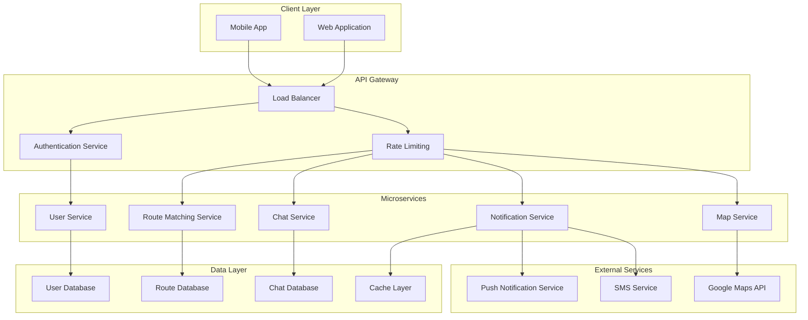
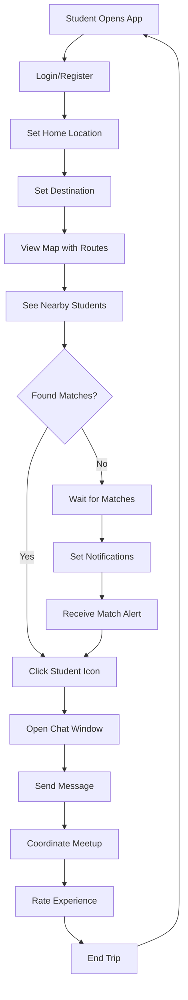
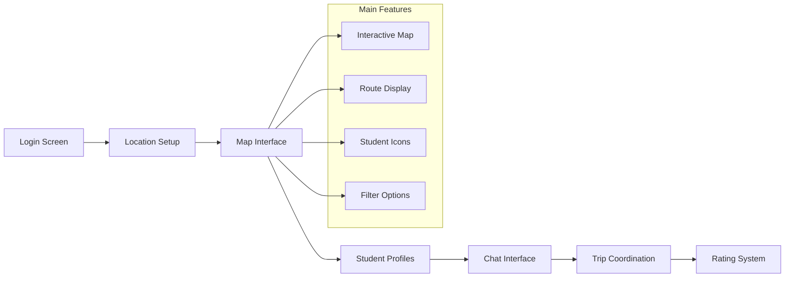
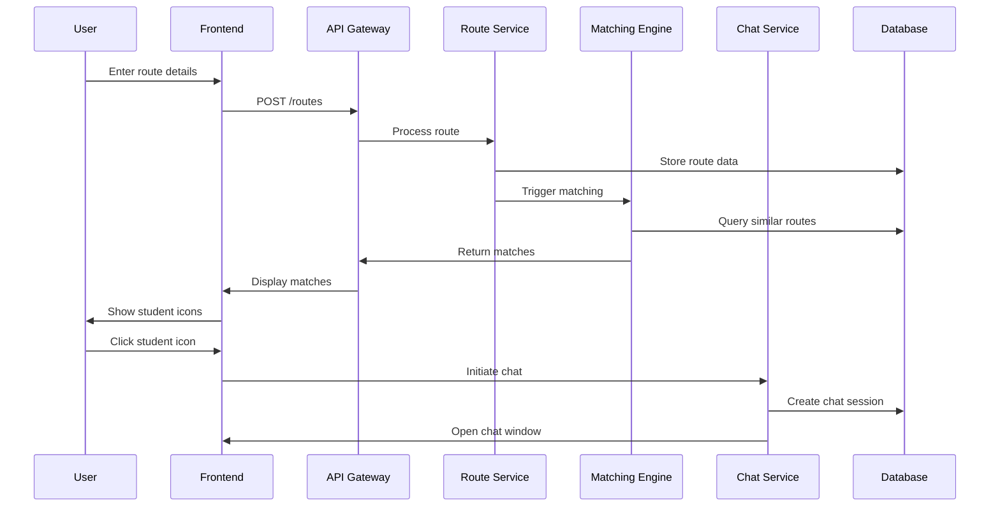
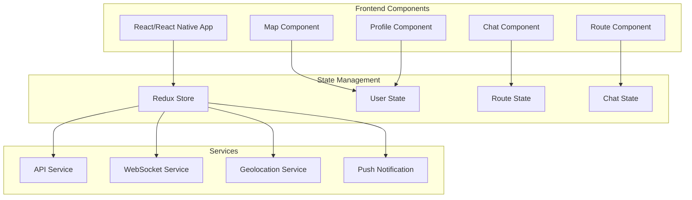
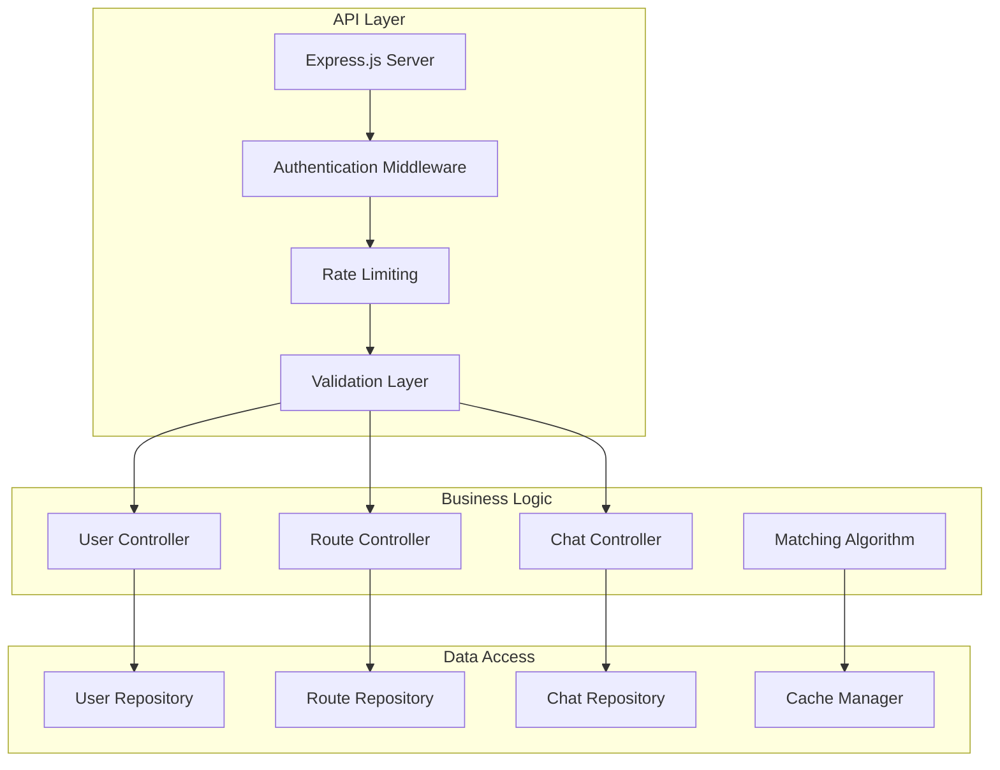
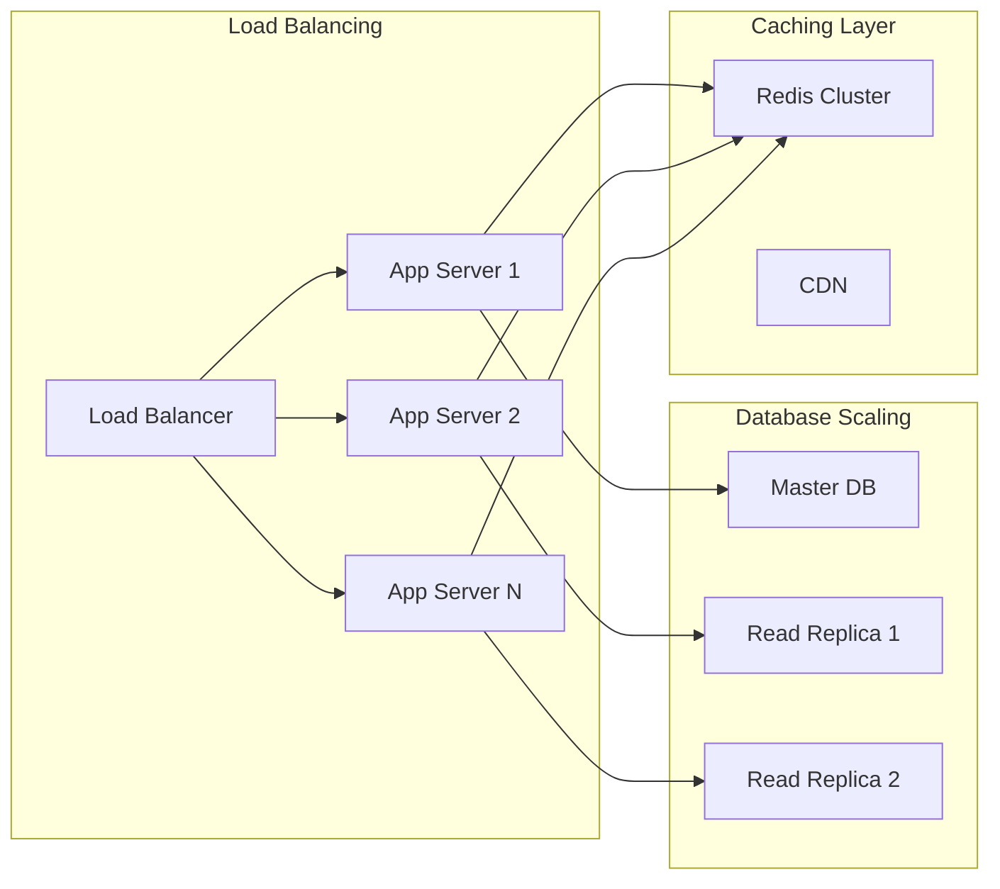
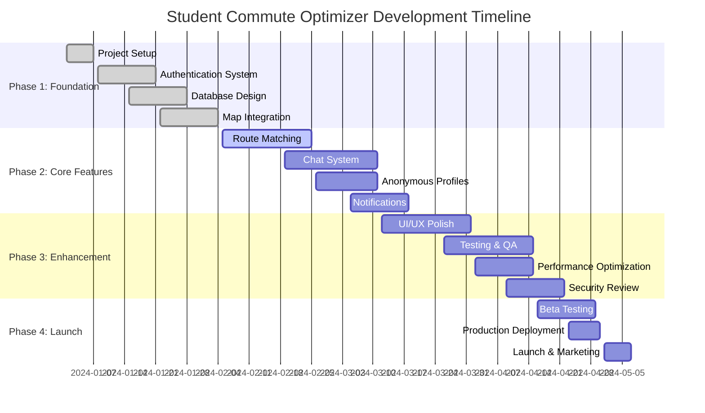

# Student Commute Optimizer - Project Documentation

## Table of Contents
- [🎯 Project Overview](#project-overview)
- [✨ Key Features](#key-features)
- [🏗️ System Architecture](#system-architecture)
- [👥 User Flow Diagram](#user-flow-diagram)
- [🗺️ User Interface Flow](#user-interface-flow)
- [🔄 Data Flow Architecture](#data-flow-architecture)
- [🛠️ Technical Specifications](#technical-specifications)
- [📊 Technology Stack Comparison](#technology-stack-comparison)
- [📋 Implementation Plan](#implementation-plan)
- [💻 Pseudocode Examples](#pseudocode-examples)
- [🔒 Security & Privacy Considerations](#security--privacy-considerations)
- [📈 Scalability Considerations](#scalability-considerations)
- [📊 Development Timeline](#development-timeline)
- [💰 Cost Estimation](#cost-estimation)
- [🚀 Future Enhancements](#future-enhancements)

---


## Project Overview

The **Student Commute Optimizer** is a full-stack carpooling and route-sharing application designed specifically for students. The platform intelligently matches students traveling along similar routes, enabling them to share rides efficiently while maintaining privacy and security through anonymous interactions.

### Problem Statement
- Students face high individual commuting costs
- Environmental impact from multiple individual trips
- Safety concerns when traveling alone
- Limited social interaction opportunities during commute

### Solution
A smart platform that:
- Matches students with similar travel routes
- Enables anonymous communication
- Optimizes carpooling opportunities
- Provides a safe, student-focused environment

---

## Key Features

### Core Features
- **Route Matching**: Intelligent algorithm to find students with overlapping travel paths
- **Anonymous Profiles**: Unique, non-duplicatable usernames for privacy
- **Real-time Chat**: Direct messaging between matched students
- **Interactive Map**: Visual representation of routes and nearby students
- **Safety Features**: User verification and reporting system

### Advanced Features
- **Smart Notifications**: Real-time alerts for new matches
- **Route Optimization**: Suggest optimal pickup/drop-off points
- **Rating System**: Peer rating for trust building
- **Schedule Coordination**: Recurring trip planning
- **Cost Splitting**: Automatic expense calculation

---

## System Architecture



## User Flow Diagram



## User Interface Flow



## Data Flow Architecture



---

## Technical Specifications

### Frontend Architecture


### Backend Architecture


---

## Technology Stack Comparison

### Frontend Technologies

| Technology | Pros | Cons | Rating | Recommendation |
|------------|------|------|--------|----------------|
| **React Native** ✅ | Cross-platform, Hot reload, Large community, Code reuse | Performance limitations, Native module dependencies | 9/10 | **Recommended** |
| Flutter | Fast performance, Single codebase, Growing community | Dart language learning curve, Larger app size | 8/10 | Alternative |
| Native iOS/Android | Best performance, Platform-specific features | Separate codebases, Higher development cost | 7/10 | Not recommended |
| PWA (React) | No app store, Easy deployment, Web technologies | Limited native features, iOS limitations | 6/10 | Not suitable |

### Backend Technologies

| Technology | Pros | Cons | Rating | Recommendation |
|------------|------|------|--------|----------------|
| **Node.js + Express** ✅ | JavaScript ecosystem, Fast development, NPM packages, Real-time features | Single-threaded, CPU-intensive limitations | 9/10 | **Recommended** |
| Python + Django | Rapid development, ML integration, Clean syntax | Slower performance, GIL limitations | 8/10 | Alternative |
| Java + Spring | Enterprise-grade, Scalable, Strong typing | Verbose, Slower development | 7/10 | Overkill |
| Go | High performance, Concurrent, Simple syntax | Smaller ecosystem, Learning curve | 8/10 | Future consideration |

### Database Technologies

| Technology | Pros | Cons | Rating | Recommendation |
|------------|------|------|--------|----------------|
| **MongoDB** ✅ | Flexible schema, JSON-like documents, Geospatial queries | No ACID transactions (older versions), Memory usage | 9/10 | **Recommended** |
| PostgreSQL | ACID compliance, Advanced features, PostGIS extension | Complex setup, Rigid schema | 8/10 | Alternative |
| Firebase | Real-time updates, Easy setup, Serverless | Vendor lock-in, Limited queries | 7/10 | Rapid prototyping |
| MySQL | Mature, Reliable, Wide support | Limited NoSQL features, Complex geo queries | 6/10 | Not recommended |

### Real-time Communication

| Technology | Pros | Cons | Rating | Recommendation |
|------------|------|------|--------|----------------|
| **Socket.io** ✅ | Easy implementation, Fallback options, Room management | Overhead, Scaling challenges | 9/10 | **Recommended** |
| WebSockets | Native browser support, Low latency, Efficient | No fallback, Connection management | 8/10 | Alternative |
| Firebase Realtime DB | Easy setup, Real-time sync, Offline support | Vendor lock-in, Cost at scale | 7/10 | Rapid prototyping |

---

## Implementation Plan

### Phase 1: Core Development (Weeks 1-4)
- [ ] Project setup and environment configuration
- [ ] Basic user authentication system
- [ ] Map integration with route input
- [ ] Database schema design and implementation
- [ ] Basic matching algorithm

### Phase 2: Matching & Communication (Weeks 5-8)
- [ ] Advanced route matching algorithm
- [ ] Anonymous user profile system
- [ ] Real-time chat implementation
- [ ] Notification system
- [ ] Basic UI/UX implementation

### Phase 3: Enhancement & Testing (Weeks 9-12)
- [ ] Advanced filtering and preferences
- [ ] Rating and feedback system
- [ ] Security enhancements
- [ ] Comprehensive testing
- [ ] Performance optimization

### Phase 4: Deployment & Polish (Weeks 13-16)
- [ ] Production deployment setup
- [ ] User acceptance testing
- [ ] Bug fixes and improvements
- [ ] Documentation completion
- [ ] Launch preparation

---

## Pseudocode Examples

### Route Matching Algorithm
```pseudocode
FUNCTION findMatchingStudents(userRoute)
    INPUT: userRoute (start_point, end_point, time, preferences)
    OUTPUT: List of matching students
    
    BEGIN
        // Define matching criteria
        maxDistance = 2 kilometers
        timeWindow = 30 minutes
        
        // Query database for potential matches
        candidateRoutes = DATABASE.query(
            WHERE start_point WITHIN maxDistance OF userRoute.start_point
            AND end_point WITHIN maxDistance OF userRoute.end_point
            AND departure_time WITHIN timeWindow OF userRoute.time
            AND user_id != userRoute.user_id
        )
        
        matches = []
        
        FOR EACH route IN candidateRoutes
            // Calculate route similarity score
            similarity = calculateRouteSimilarity(userRoute, route)
            
            IF similarity > 0.7 THEN
                // Calculate shared distance percentage
                sharedDistance = calculateSharedPath(userRoute, route)
                
                IF sharedDistance > 0.5 THEN
                    match = {
                        student: route.user,
                        similarity: similarity,
                        sharedDistance: sharedDistance,
                        estimatedSavings: calculateSavings(userRoute, route)
                    }
                    matches.APPEND(match)
                END IF
            END IF
        END FOR
        
        // Sort by similarity and shared distance
        matches = SORT(matches, BY similarity DESC, sharedDistance DESC)
        
        RETURN matches[0:10] // Return top 10 matches
    END
END FUNCTION

FUNCTION calculateRouteSimilarity(route1, route2)
    // Use haversine formula for distance calculation
    startDistance = haversineDistance(route1.start, route2.start)
    endDistance = haversineDistance(route1.end, route2.end)
    
    // Normalize distances (closer = higher similarity)
    startSimilarity = MAX(0, 1 - (startDistance / 5000)) // 5km max
    endSimilarity = MAX(0, 1 - (endDistance / 5000))
    
    // Calculate time similarity
    timeDiff = ABS(route1.time - route2.time) // in minutes
    timeSimilarity = MAX(0, 1 - (timeDiff / 60)) // 1 hour max
    
    // Weighted average
    similarity = (startSimilarity * 0.4) + (endSimilarity * 0.4) + (timeSimilarity * 0.2)
    
    RETURN similarity
END FUNCTION
```

### Anonymous Chat System
```pseudocode
FUNCTION createAnonymousChat(user1_id, user2_id)
    INPUT: Two user IDs who want to chat
    OUTPUT: Chat session with anonymous identifiers
    
    BEGIN
        // Generate anonymous identifiers
        user1_alias = generateUniqueAlias()
        user2_alias = generateUniqueAlias()
        
        // Create chat session
        chatSession = {
            id: generateUUID(),
            participants: [
                {user_id: user1_id, alias: user1_alias},
                {user_id: user2_id, alias: user2_alias}
            ],
            created_at: getCurrentTimestamp(),
            status: "active",
            route_context: getRouteContext(user1_id, user2_id)
        }
        
        // Store in database
        DATABASE.chatSessions.INSERT(chatSession)
        
        // Create websocket rooms
        WEBSOCKET.createRoom(chatSession.id)
        WEBSOCKET.joinRoom(user1_id, chatSession.id)
        WEBSOCKET.joinRoom(user2_id, chatSession.id)
        
        RETURN chatSession
    END
END FUNCTION

FUNCTION sendMessage(chatSession_id, sender_id, message)
    INPUT: Chat session, sender, and message content
    OUTPUT: Delivered message with anonymous sender
    
    BEGIN
        // Validate sender is participant
        IF NOT isParticipant(sender_id, chatSession_id) THEN
            RETURN error("Unauthorized")
        END IF
        
        // Get sender's alias
        senderAlias = getSenderAlias(sender_id, chatSession_id)
        
        // Create message object
        messageObj = {
            id: generateUUID(),
            chat_session_id: chatSession_id,
            sender_alias: senderAlias,
            content: sanitizeMessage(message),
            timestamp: getCurrentTimestamp(),
            message_type: "text"
        }
        
        // Store message
        DATABASE.messages.INSERT(messageObj)
        
        // Send to all participants via websocket
        WEBSOCKET.broadcast(chatSession_id, messageObj)
        
        // Send push notification to offline users
        sendPushNotification(chatSession_id, sender_id, message)
        
        RETURN messageObj
    END
END FUNCTION
```

### Route Optimization
```pseudocode
FUNCTION optimizePickupPoints(studentRoutes)
    INPUT: List of student routes for carpooling
    OUTPUT: Optimized pickup/dropoff points
    
    BEGIN
        // Cluster students by proximity
        clusters = clusterByLocation(studentRoutes)
        optimizedRoutes = []
        
        FOR EACH cluster IN clusters
            // Find central pickup point
            centralPoint = calculateCentroid(cluster.startPoints)
            
            // Find optimal route through all destinations
            destinations = EXTRACT(cluster, 'end_point')
            optimalRoute = solveTSP(centralPoint, destinations)
            
            // Calculate time and cost savings
            savings = calculateSavings(cluster.originalRoutes, optimalRoute)
            
            optimizedRoute = {
                pickup_point: centralPoint,
                route: optimalRoute,
                participants: cluster.students,
                estimated_savings: savings,
                total_distance: calculateDistance(optimalRoute),
                estimated_time: calculateTravelTime(optimalRoute)
            }
            
            optimizedRoutes.APPEND(optimizedRoute)
        END FOR
        
        RETURN optimizedRoutes
    END
END FUNCTION
```

---

## Security & Privacy Considerations

### Data Protection
- End-to-end encryption for chat messages
- Anonymous user profiles with no personal data exposure
- Secure token-based authentication
- GDPR compliance for user data handling

### Safety Features
- User verification through institutional email
- Report and block functionality
- Emergency contact integration
- Trip sharing with trusted contacts

### Technical Security
- Input validation and sanitization
- Rate limiting to prevent abuse
- Secure API endpoints with authentication
- Regular security audits and updates

---

## Scalability Considerations

### Horizontal Scaling


### Performance Optimization
- Database indexing for geospatial queries
- Caching frequently accessed routes
- CDN for static assets
- Lazy loading for mobile app components
- Background processing for matching algorithms

---

## Development Timeline



---

## Cost Estimation

### Operational Costs (Monthly)
| Service | Cost Range |
|---------|------------|
| Cloud Hosting (AWS/GCP) | $200 - $500 |
| Database (MongoDB Atlas) | $100 - $300 |
| Maps API (Google Maps) | $100 - $400 |
| Push Notifications | $50 - $150 |
| **Total Monthly** | **$450 - $1,350** |

---

## Future Enhancements

### Phase 2 Features
- AI-powered route prediction
- Integration with campus shuttle systems
- Carbon footprint tracking
- Loyalty points and rewards system
- Multi-modal transport integration

### Advanced Features
- Machine learning for better matching
- Predictive analytics for demand forecasting
- Integration with university systems
- Electric vehicle preferences
- Weather-based route adjustments

---

This comprehensive documentation provides both technical and business stakeholders with a clear understanding of the Student Commute Optimizer project, its implementation strategy, and expected outcomes. The modular approach ensures scalability and maintainability while the focus on privacy and security addresses key concerns in student-focused applications.
